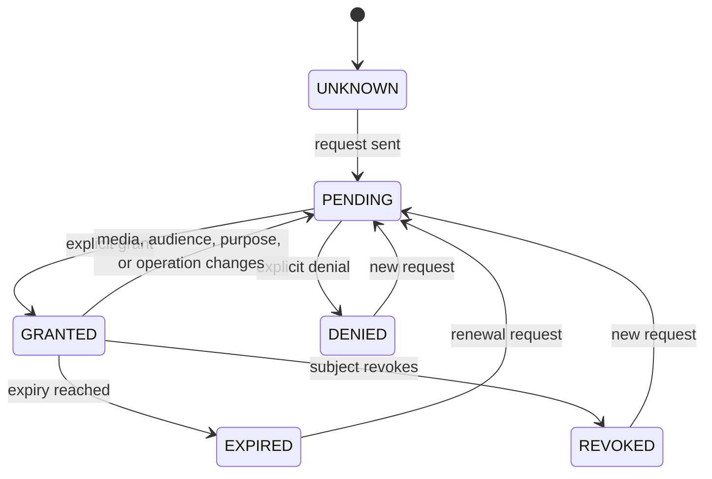
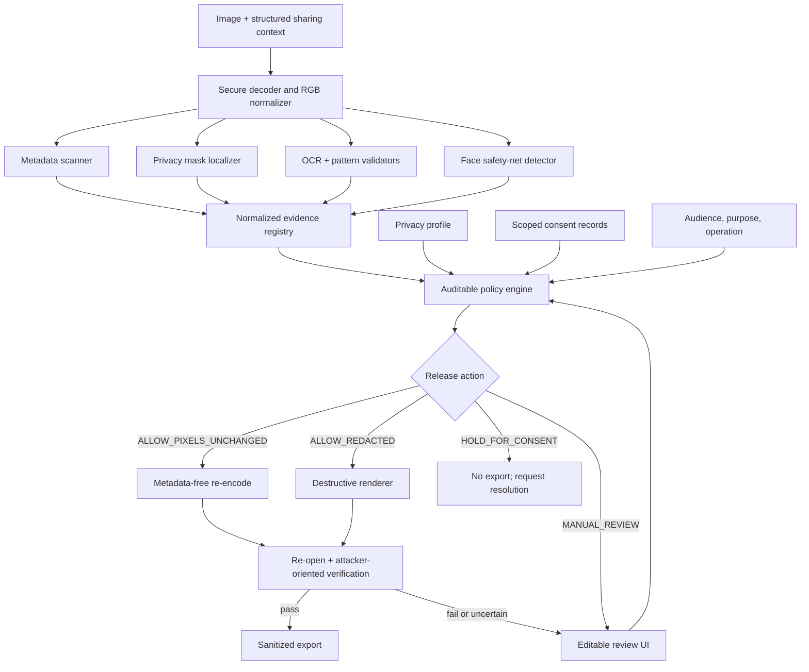

# From Detection to Safe Release

## Final research plan for consent-state-aware visual redaction under uncertainty

**Working repository name:** `consentGuard` (historical only)  
**Paper/project title:** *From Detection to Safe Release: Auditing Consent-State-Aware Visual Redaction Under Uncertainty*  
**Version:** 2.1  
**Audit date:** 12 August 2026  
**Core scope:** Still images only  
**Status:** Approved direction, subject to the data, ethics, and leakage gates in this document  

> This document supersedes the earlier VPD-first and learned-fusion plans. It is the single source of truth for the project.

> **Data-source correction:** Visual Redactions masks require the separate
> Visual Redactions image archives. Matching `2017_xxxxxxxx` identifiers do not
> establish identity with VISPR pixels. Any later section that implies VISPR
> supplies pixels for these masks is superseded by this correction and the
> forensic audit dated 12 August 2026.

---

## 1. Executive decision

### Final verdict

The original idea is useful, but the previous architecture was too broad and its novelty claim was not defensible. The revised project is solid if it is treated as a **safety and decision-policy research project built on top of visual privacy detection**, not as a claim that we invented automatic redaction, personalized privacy scoring, context-aware privacy, or consent-aware face protection.

The project will build and evaluate a pre-share assistant that:

1. detects and localizes privacy-sensitive visual evidence;
2. reads only explicit, structured, scoped consent assertions;
3. applies an auditable policy to each region or depicted subject;
4. chooses one of four actions: release with pixels unchanged after metadata cleaning, release after redaction, hold for consent, or request manual review;
5. creates a new, flattened, metadata-free output;
6. attacks the output with OCR, barcode, metadata, and recognition tests before calling the redaction successful.

### What changed from the old plan

| Old plan | Final decision | Reason |
|---|---|---|
| Learned image-caption-consent fusion predicts Low/Medium/High risk | Remove from the core; keep only as an optional comparison | Synthetic scenarios would let a model memorize the label-generation rules, and a scalar risk level hides the required action |
| VPD-100K detector is the first component | Remove from the critical path | The current public repository contains videos but no visible 100,000-image bounding-box release |
| Image and video are both first-class | Image-only core; video is future work | Video adds tracking, temporal leakage, audio privacy, and much larger evaluation scope |
| System detects possible non-consensual or harmful disclosure | System processes explicit consent state and policy; it does not infer intent or consent | Consent, coercion, ownership, intent, and legality cannot be reliably inferred from pixels |
| Blur/pixelation are ordinary privacy options | Solid replacement or crop is the safety default for high-risk content | Blur and pixelation can remain recognizable or partially reversible |
| `ConsentGuard` is the project title | Keep only as a folder name; use the descriptive paper title | The name is already used by multiple unrelated privacy products |
| Novelty is “visual + context + consent fusion” | Contribution is a formal action protocol and end-to-end safety audit | All broad components already exist in prior work |

### One-sentence research problem

> How reliably can a modular system convert uncertain visual detections and explicit, scoped consent states into auditable release actions while minimizing both residual privacy leakage and unnecessary destruction of image utility?

### Go/no-go recommendation

**Go**, with the following non-negotiable constraints:

- no claim that consent or malicious intent is inferred automatically;
- no VPD dependency in the core experiments;
- no training and testing on overlapping VISPR/Visual Redactions images;
- no evaluation based only on mask AP, SSIM, or how safe an image looks;
- no automatic public release when consent or localization is unresolved;
- no product, legal-compliance, or privacy-guarantee claims.

---

## 2. Is this a copy of another project?

### Short answer

It is **not a direct copy of one paper or repository**, but the old proposal combined several ideas that have each already been published. Simply connecting those components would be system integration, not a new research contribution.

### Closest prior work and exact overlap

| Prior work | What already exists | Consequence for this project |
|---|---|---|
| [Towards a Visual Privacy Advisor (ICCV 2017)](https://openaccess.thecvf.com/content_iccv_2017/html/Orekondy_Towards_a_Visual_ICCV_2017_paper.html) | 68 visual privacy attributes, user-specific preferences, personalized privacy-risk prediction | Do not claim personalized image privacy scoring as new |
| [Connecting Pixels to Privacy and Utility (CVPR 2018)](https://openaccess.thecvf.com/content_cvpr_2018/papers_backup/Orekondy_Connecting_Pixels_to_CVPR_2018_paper.pdf) | Pixel/instance localization, automatic redaction, and privacy-utility evaluation | Do not claim segmentation-based automatic redaction as new |
| [iPrivacy (IEEE TIFS)](https://doi.org/10.1109/TIFS.2016.2636090) | Privacy-sensitive object detection, preference recommendation, and visual protection | Do not claim detect-recommend-obfuscate as new |
| [Toward Automated Online Photo Privacy](https://doi.org/10.1145/2983644) | Image features and textual/metadata features for predicting sharing settings | Do not claim multimodal privacy-setting prediction as new |
| [PrivObfNet (WACV 2024)](https://openaccess.thecvf.com/content/WACV2024/html/Tay_PrivObfNet_A_Weakly_Supervised_Semantic_Segmentation_Model_for_Data_Protection_WACV_2024_paper.html) | Privacy score, attribute prediction, localization, and obfuscation from image-level supervision | The old end-to-end architecture is especially close to this work |
| [Resolving Multi-party Privacy Conflicts](https://arxiv.org/abs/1507.04642) | Computational resolution of conflicting privacy preferences for shared items | Do not claim multi-party conflict handling as a new concept |
| [Enable Portrait Privacy Protection](https://arxiv.org/abs/1410.6582) | Explicit privacy requirements associated with people in captured photos | Do not claim explicit per-person privacy policy as new |
| [LAMP](https://arxiv.org/abs/2103.10851) | Location-aware multi-party image access control and face replacement | Do not claim subject-specific protection from explicit policy as new |
| [Everyone's Privacy Matters (CSCW 2025)](https://doi.org/10.1145/3710967) | Bystander/subject classification and a proposed uploader confirmation workflow | Do not claim uploader confirmation of bystanders as new |
| [See Me If You Can (CHI 2026)](https://doi.org/10.1145/3772318.3790394) | Privacy-by-default face obfuscation and consent-based restoration | Do not claim consent-based visual protection or restoration as new |
| [MPCI-Bench (2026 preprint)](https://arxiv.org/abs/2601.08235) | Positive/negative contexts paired to the same VISPR image for multimodal contextual-integrity evaluation | Do not claim same-image contrastive privacy contexts as new |
| [CAIAMAR (CVPRW 2026)](https://openaccess.thecvf.com/content/CVPR2026W/GRAIL-V/html/Aufschlager_Towards_Context-Aware_Image_Anonymization_with_Multi-Agent_Reasoning_CVPRW_2026_paper.html) | Context-aware PII segmentation and anonymization using multi-agent reasoning | Do not claim context-aware anonymization broadly as new |

### Name audit

`ConsentGuard` is already used by at least a [consent-management service](https://consentguard.io/) and an [AI-agent governance service](https://www.getconsentguard.com/). The folder can keep its current name, but the paper, demo, and repository should use the descriptive title above until a proper trademark and repository-name search is completed.

### Defensible contribution after the audit

The project should claim an **operationalization and evaluation contribution**, not invention of the underlying ideas:

1. A precise action-level task that separates perception, consent state, policy, redaction, and post-redaction assurance.
2. A scoped consent lifecycle covering grant, denial, expiry, revocation, unknown state, audience, purpose, operation, and media version.
3. A consent-intervention test suite that checks whether the same image receives the correct action when only consent scope changes. Pairing itself is not claimed as new.
4. An uncertainty-aware release protocol with explicit `HOLD_FOR_CONSENT` and `MANUAL_REVIEW` outcomes instead of forced Low/Medium/High predictions.
5. End-to-end evaluation that separates detector failure from renderer failure and measures recoverability by realistic attackers.

This is a defensible undergraduate/master's research contribution. A publication-level “first” claim must wait for a formal systematic review and should not be written into the abstract now.

### Exact delta from the closest systems

| Closest system | Their center of gravity | This project's narrower delta |
|---|---|---|
| Connecting Pixels / PrivObfNet | Detect, localize, score, and obfuscate private visual content | Add scoped consent state, hold/review actions, and independent export-recovery testing |
| See Me If You Can | Privacy-by-default faces and consent-based restoration on camera glasses | Handle multiple privacy-evidence types in still-image sharing, lifecycle scope/revocation, and destructive release assurance |
| MPCI-Bench | Paired contextual-integrity judgments and agent traces over VISPR images | Evaluate concrete region-level release/redaction actions rather than an LLM's binary privacy judgment |
| Multi-party conflict work / LAMP | Resolve co-owner preferences or protect identified people | Avoid identity inference, make unknown association explicit, and measure unsafe release under uncertainty |

The project should be presented as **a reproducible reference architecture and safety evaluation**, not a new foundation model or a universal theory of consent.

---

## 3. Exact task definition

### 3.1 Core use case

A person is about to share a still image. The assistant scans the image locally, shows privacy-sensitive regions, accepts explicit structured context and consent state, proposes safe actions, allows correction, and exports a sanitized copy.

### 3.2 Inputs

- one JPEG, PNG, or WebP still image;
- optional caption for reviewer display, treated as untrusted context rather than consent proof or a fully analyzed text channel;
- intended audience and purpose;
- uploader's privacy profile;
- zero or more consent records linked manually to depicted-subject regions;
- policy version and desired export format.

### 3.3 Outputs

- normalized sensitive-evidence records with location, class, source, and uncertainty;
- region- or subject-level action and human-readable reason;
- one aggregate release action;
- editable redaction preview;
- newly encoded, flattened, metadata-free sanitized image when release is allowed;
- privacy-minimized audit event containing no raw OCR values or thumbnails.

### 3.4 Aggregate release actions

```text
ALLOW_PIXELS_UNCHANGED no protected evidence remains; metadata is still stripped
ALLOW_REDACTED        required regions were destructively redacted and verified
HOLD_FOR_CONSENT      a known deny/revocation/scope mismatch or unresolved co-owner blocks release
MANUAL_REVIEW         perception, subject association, policy input, or post-redaction verification is uncertain
```

These are actions, not moral or legal judgments. The UI may show a supplementary severity explanation, but it must never replace the action.

### 3.5 Explicit non-goals

The core system will not:

- infer consent, coercion, relationship, ownership, intent, guilt, or legality from an image;
- identify a depicted person by face recognition;
- make police, platform-reporting, disciplinary, or legal decisions;
- guarantee anonymity after an image has already been shared;
- protect private speech or background audio;
- process video in the core study;
- use a general-purpose vision-language model to make final release decisions;
- claim complete privacy analysis of caption text; the core policy uses structured audience and purpose fields;
- advertise GDPR, CCPA, DPDP, HIPAA, or other legal compliance.

---

## 4. Concepts that must remain separate

| Concept | Meaning | Produced by |
|---|---|---|
| Detection confidence | How confident a model is that a region belongs to a visual class | Perception model |
| Sensitivity tier | Consequence if that evidence is exposed | Authored ontology/policy |
| Consent state | Explicit assertion about a subject and a particular use | Consent record, never pixels |
| Scope match | Whether audience, purpose, operation, and media version match the grant | Policy engine |
| Release action | What the system should do now | Policy engine plus uncertainty gates |
| Residual leakage | What an attacker can still recover after export | Assurance tests |
| Utility | Information or task value retained after protection | Area/task/human evaluation |

A high-confidence face detection does not prove high disclosure harm. A low-confidence passport-number detection must not be silently ignored. Consent for capture does not imply consent for public upload, and upload consent does not imply consent for redistribution.

---

## 5. Research questions and hypotheses

### Research questions

**RQ1 — Perception:** How well do a mask localizer, OCR/structured-text branch, face safety-net detector, and metadata scanner find privacy-sensitive evidence, especially small and low-salience items?

**RQ2 — Decision policy:** Under missing, stale, conflicting, and scope-mismatched consent, how does an explicit scoped policy trade unsafe releases, over-protection, and review burden against visual-only, learned, fail-open, and fail-closed baselines?

**RQ3 — Uncertainty:** How does adding abstention/manual review change unsafe-release rate, review burden, and coverage?

**RQ4 — Protection:** Which destructive redaction strategy best reduces attacker recovery while retaining task utility?

**RQ5 — Human control:** Can users understand and correct the proposed regions and release reasons without developing false confidence in the system?

### Testable hypotheses

- **H1:** Combining segmentation, OCR/validators, metadata scanning, and a face detection safety net improves severity-weighted sensitive-instance recall over a segmentation-only baseline.
- **H2:** Under missing, stale, conflicting, and scope-mismatched consent inputs, explicit state handling produces fewer unsafe releases than a fail-open scalar-risk baseline at matched review burden.
- **H3:** A predefined abstention rule lowers selective error among automatically released cases, with a measurable increase in review burden.
- **H4:** Solid replacement or cropping yields lower token/identity recovery than blur at comparable retained utility.
- **H5:** Per-region redaction preserves more non-sensitive information than redact-all and whole-image blocking baselines.

If a hypothesis is not supported, report the negative result. Do not rewrite metrics or thresholds after seeing the test set.

---

## 6. Threat model

### 6.1 Assets to protect

- visible identifiers, credentials, biometrics, documents, and sensitive contextual evidence;
- EXIF/GPS/XMP/IPTC metadata and embedded thumbnails;
- consent records and subject-region associations;
- unredacted originals, temporary files, logs, checkpoints, and caches;
- the integrity of policy rules, model weights, thresholds, and exports.

### 6.2 Adversaries and failures in scope

1. **Accidental uploader:** does not notice private content or uses the wrong audience.
2. **Curious recipient:** applies OCR, barcode decoding, enhancement, recognition, cropping, or recompression to the exported image.
3. **Dishonest uploader:** falsely claims consent or supplies misleading caption/context.
4. **Malicious file:** uses malformed metadata, huge dimensions, decompression bombs, animation, or parser edge cases.
5. **Operational mistake:** stores raw text in logs, exports the original alpha layer, leaves metadata, mixes two users' sessions, or uses the wrong policy version.
6. **Distribution shift:** presents screenshots, reflections, unusual scripts, occlusion, low contrast, tiny objects, or classes absent from training.

### 6.3 Trust boundary

The research prototype is local-first. Raw images and OCR values must not be sent to third-party APIs. Models and OCR run on the local machine or a controlled research environment. If remote training is later required, only licensed research data is transferred under the institution's approved process.

### 6.4 Out-of-scope adversaries

- a recipient who already possesses the original;
- platform-side copies created before redaction;
- physical observation of the scene;
- recovery from other photos, clothing, location, social graph, or external databases;
- screenshots of an original displayed outside the assistant;
- complete prevention of re-identification from body shape, tattoos, surroundings, or cross-image linkage.

These limitations must appear in the demo and paper.

---

## 7. Consent model

### 7.1 Consent is a record, not a visual prediction

The system can process a consent assertion; it cannot prove that the person freely gave informed consent. Every record therefore includes its source and assurance level.

### 7.2 Required record schema

```json
{
  "record_id": "random UUID",
  "subject_ref": "local pseudonym, not a real name",
  "region_refs": ["person-region-2"],
  "media_version": "exact SHA-256 or local keyed digest",
  "share_context_version": "digest of operation, audience, purpose, and any bound caption",
  "operation": "UPLOAD | REDISTRIBUTE",
  "audience": "PRIVATE_GROUP | ORGANIZATION | PUBLIC | CUSTOM",
  "purpose": "user-selected controlled vocabulary",
  "state": "UNKNOWN | PENDING | GRANTED | DENIED | REVOKED | EXPIRED",
  "issued_at": "ISO-8601 timestamp or null",
  "expires_at": "ISO-8601 timestamp or null",
  "revoked_at": "ISO-8601 timestamp or null",
  "assertion_source": "UPLOADER_ASSERTED | SUBJECT_CONFIRMED | VERIFIED_WORKFLOW",
  "policy_version": "semantic version",
  "notes": "optional; never treated as proof"
}
```

For released research data, `subject_ref` must refer only to an abstract scenario subject. Do not publish names, contact details, signatures, biometric templates, or raw consent forms.

### 7.3 State transitions



### 7.4 Scope rules

- Grant for **capture** is not grant for **upload**.
- Grant for upload to a private group is not grant for a public post.
- Grant for one purpose is not automatically reusable for another.
- Grant for one image version does not automatically transfer to a materially changed crop, montage, caption, or redistribution.
- Revocation wins over an older grant for future actions.
- Two records with unresolved equal-priority conflict lead to `HOLD_FOR_CONSENT`.
- Missing data remains `UNKNOWN`; it is never silently converted to granted or denied.

### 7.5 Multiple depicted people

- Policy is resolved per subject, not by majority vote.
- A grant by the uploader cannot override another subject's denial.
- Each subject can be redacted independently when localization is reliable.
- If protected and allowed subjects overlap so that selective editing is unsafe, hold the whole image for review.
- In the MVP, the uploader manually binds detected person regions to abstract consent records. Automatic identity matching is excluded.

---

## 8. Final architecture



### Why this architecture is stronger

- Learned models answer perceptual questions; they do not decide whether a consent record is valid.
- Policy decisions are reproducible and can be unit-tested.
- Unknown state has an explicit safe path.
- Renderer safety can be tested independently with oracle masks.
- End-to-end failure can be traced to perception, policy, rendering, or export.
- A caption cannot override a denial or trick a language model into releasing content.

---

## 9. Component design

### 9.1 Secure ingest and normalization

1. Verify the file signature rather than trusting the extension.
2. Allow only explicitly supported still-image formats.
3. Reject animation in the MVP.
4. Enforce maximum file bytes, decoded pixel count, dimensions, and aspect ratio.
5. Decode once in an isolated worker where practical.
6. Apply EXIF orientation, then convert to a fresh RGB buffer.
7. Inspect metadata but never copy it into the export.
8. Generate a session-local identifier; do not use a public perceptual hash as an identity token.

### 9.2 Privacy mask localizer

**Reproducible baseline:** Mask R-CNN with a ResNet-50 FPN backbone, initialized from COCO and fine-tuned on Visual Redactions polygons/masks.

Reasons:

- Visual Redactions provides COCO-like instance and pixel annotations;
- masks are directly usable by the renderer;
- the model is a clear, widely understood baseline;
- it avoids pretending that unavailable VPD boxes exist.

**Hardware-aware protocol:** The observed local GPU is an RTX 3050 Laptop GPU with 4 GB VRAM. Use 512-pixel training crops, automatic mixed precision, batch size 1, gradient accumulation, and a short frozen-backbone smoke run locally. Full-resolution training or a stronger model should use a controlled 12–16 GB GPU. Do not silently lower resolution until small text disappears.

**Optional stronger comparison:** one modern instance/semantic segmentation model may be added only after the entire baseline, policy engine, and evaluation suite work. It is not required for the thesis to be valid.

### 9.3 OCR and structured-text branch

Use a pinned local PaddleOCR or equivalent open OCR release. Preserve word/line polygons and confidence, then run typed validators:

- Luhn check for possible payment-card numbers;
- IBAN/checksum validation where applicable;
- email, phone, IP address, account/reference, and date patterns;
- QR and common barcode decoding;
- conservative named-entity recognition for names and addresses, routed to review when confidence is weak;
- document-zone expansion so the renderer covers the complete value, not only recognized characters.

Never write recognized strings to ordinary logs. Tests use synthetic fake values.

### 9.4 Face safety-net branch

Use a pinned face detector strictly for localization, not identification. Its purpose is to improve recall for small, rotated, reflected, or partially occluded faces that a broad privacy localizer may miss. Audit the checkpoint and license before use.

No face embeddings, watchlists, identity search, or automatic consent association are required in the MVP.

### 9.5 Metadata branch

Inspect EXIF, GPS, XMP, IPTC, comments, embedded thumbnails, color profiles, and format-specific application blocks. The safe output is written from the normalized pixel buffer to a new file with an explicit metadata allowlist; copying the source file and deleting a few tags is not sufficient.

### 9.6 Evidence registry

Each evidence item contains:

```text
evidence_id
source_module
privacy_class
ontology_group
mask_or_polygon
confidence
uncertainty_flags
sensitivity_tier
subject_ref_or_unknown
detector_version
```

Overlapping OCR, mask, and face detections are merged spatially but their provenance is retained. Contradictory detections are shown to the reviewer instead of being discarded.

### 9.7 Policy engine

Implement the policy as versioned data plus deterministic code. Use JSON Schema/Pydantic-style validation, exhaustive enum handling, and table-driven tests. Unknown enum values must fail closed.

The engine receives evidence, profile, consent records, audience, purpose, operation, and current time. It returns per-evidence actions, aggregate action, reason codes, and the policy version.

### 9.8 Reviewer interface

The user can:

- add, remove, resize, split, or merge masks;
- change a misclassified privacy category;
- bind a person region to an abstract consent record;
- inspect why a region is protected;
- see the difference between detector confidence and policy reason;
- request consent or choose not to export;
- preview the final full-resolution raster.

The UI must never use a green “safe” badge. Prefer “No detected issue after checks” and display residual limitations.

### 9.9 Renderer and assurance loop

For critical/high-sensitivity regions, use solid replacement, whole-field replacement, or cropping. Blur and pixelation are experimental comparators, not default guarantees. Prior work demonstrates that learned models can recover information from common obfuscation methods, and recent work reports reversibility in practical Gaussian blur implementations ([McPherson et al.](https://arxiv.org/abs/1609.00408), [Privacy Blur](https://arxiv.org/abs/2512.16086)).

Renderer steps:

1. resize masks back to original resolution;
2. dilate masks using a resolution-scaled margin selected on validation data;
3. cover the complete sensitive field, including character edges and QR quiet zones;
4. flatten all layers and alpha against an opaque background;
5. encode a new image without source metadata or thumbnails;
6. re-open the file with a separate decoder;
7. rerun OCR, barcode, metadata, face, and residual-mask checks;
8. expand and rerender if a check fails;
9. after a bounded number of attempts, return `MANUAL_REVIEW`, never an unchecked export.

Do not use generative inpainting in the core system. It may reconstruct plausible sensitive content, alter evidence, or create misleading imagery.

---

## 10. Privacy ontology and policy floor

### 10.1 Ontology groups

| Group | Examples | Default handling |
|---|---|---|
| Authentication secrets | passwords, OTPs, recovery codes, access QR codes, private keys | Always destructive redaction; no ordinary override |
| Financial/government identifiers | card/account numbers, passport, government ID, tax identifiers | Destructive redaction or hold |
| Contact/location identifiers | full address, phone, email, plates, GPS | Profile- and audience-aware, with public-share protection by default |
| Biometrics and person identity | faces, signatures, fingerprints, distinctive tattoos | Per-subject consent/profile action; unknown public-share state is conservative |
| Medical or intimate documents | prescriptions, reports, intimate records | Redact/hold; never infer diagnosis as a fact |
| Screens and documents | screens, letters, tickets, forms | Detect container plus OCR contents; review when text is unreadable |
| Contextual/global attributes | affiliations, relationships, location context, activities | Warning or whole-image review; do not fabricate a precise mask |

### 10.2 Critical safety floor

Authentication secrets and complete high-impact credentials are redacted regardless of a weak user profile. A research prototype should not export them unmodified. The user can always leave the tool, but the tool itself does not certify or facilitate that release.

### 10.3 Decision table

| Evidence/consent condition | Per-region action | Aggregate consequence |
|---|---|---|
| Critical secret detected | Redact | `ALLOW_REDACTED` after verification |
| Known denial or revocation | Redact subject if reliable; otherwise hold | Redacted release or `HOLD_FOR_CONSENT` |
| Expired grant or scope mismatch | Treat as no valid grant | Hold or redact according to category |
| In-scope explicit grant | Allow subject region unless independent critical evidence exists | Continue evaluating other regions |
| Unknown third-party consent for public release | Redact if reliably localizable; otherwise hold | Redacted release or hold |
| Unknown consent for restricted/private audience | Apply documented profile; often review | `MANUAL_REVIEW` or redacted release |
| Protected evidence but uncertain localization | Do not auto-release | `MANUAL_REVIEW` |
| Global sensitive warning with no defensible mask | Do not pretend to redact a small region | Whole-image review/hold |
| No sensitive evidence detected | Strip metadata and run negative checks | `ALLOW_PIXELS_UNCHANGED` only after checks |
| Post-redaction assurance fails | Expand/retry; then stop | `MANUAL_REVIEW` |

### 10.4 Simplified policy pseudocode

```python
for evidence in evidence_registry:
    if evidence.is_critical_secret:
        action[evidence] = REDACT
    elif evidence.localization_is_uncertain:
        action[evidence] = REVIEW
    elif evidence.has_subject:
        consent = resolve_scoped_consent(evidence.subject, share_context)
        if consent in {DENIED, REVOKED, EXPIRED, SCOPE_MISMATCH}:
            action[evidence] = REDACT_OR_HOLD
        elif consent == GRANTED:
            action[evidence] = apply_independent_privacy_profile(evidence)
        else:
            action[evidence] = conservative_unknown_policy(evidence, audience)
    else:
        action[evidence] = apply_privacy_profile(evidence)

aggregate = fail_closed_aggregate(action)
```

This pseudocode is explanatory. Production logic must use exhaustive typed states and table-driven tests.

---

## 11. Dataset plan

### 11.1 Required public data

#### Visual Redactions — core localization dataset

Use the official masks as the primary perception dataset.

Current validated local annotations:

- train: 3,873 images, 21,489 region instances;
- validation: 1,611 images, 9,710 instances;
- test: 2,989 images, 17,647 instances;
- total: 8,473 images, 48,846 instances;
- release files contain 28 distinct `attr_id` values.

The associated images are a subset of VISPR and should be resolved by image ID across VISPR folders.

#### VISPR — image source and optional auxiliary ablation

Use VISPR to obtain the image files required by Visual Redactions. Its 68 image-level privacy attributes may support an optional global-warning classifier, but VISPR does not contain real consent labels and is not a non-consensual-content dataset.

Current validated local annotations:

- train: 10,000 JSON files;
- validation: 4,167;
- test: 8,000;
- total: 22,167.

#### VPD public repository — non-core, video-only access observed

The current Hugging Face repository exposes about 2,462 video rows and roughly 33 GB, with no JSON/XML/YAML annotations found in the dry-run inventory. Do not use it to train the image localizer unless the official 100,000-image annotations, class map, split, and license are separately obtained and verified.

The current download can be retained for a future video demo, but the project can start and finish without it.

### 11.2 Optional external generalization data

[BIV-Priv-Seg](https://arxiv.org/abs/2407.18243) contains 1,028 images with segmentation annotations for 16 private-object categories from blind/low-vision users. It is valuable as a domain-shift test because the paper reports difficulty with small, non-salient, non-text objects and with recognizing images containing no private content. Add it only after its current access terms and license are verified; it is not needed for the first implementation milestone.

### 11.3 Synthetic fake-PII test corpus

Generate documents, screens, cards, tickets, and forms containing only fictional values. Vary:

- font, scale, rotation, blur, glare, perspective, compression, background, and language/script;
- valid and invalid checksums;
- text near borders and occlusions;
- QR/barcode versions and error-correction levels;
- screenshots and photographs of displays.

Store the ground-truth value and polygon in a restricted test manifest. This corpus evaluates OCR and post-redaction recovery without collecting real credentials.

### 11.4 Consent-intervention test suite

This is a **policy test suite**, not a dataset for training a model to rediscover its own rules.

#### Pilot

- 100 distinct base images;
- at least six controlled consent interventions per image;
- at least 600 action cases;
- balanced coverage of person, text, document, credential, and global-warning cases.

#### Final target

- at least 500 distinct base images;
- at least 3,000 paired/intervention cases;
- multi-subject and overlapping-region cases;
- malformed, missing, conflicting, expired, revoked, and scope-mismatched records.

#### Required interventions

Keep pixels fixed and change one factor at a time:

1. granted for intended public upload;
2. granted only for a private audience, followed by public upload;
3. denied;
4. unknown/pending;
5. expired;
6. revoked after an older grant;
7. upload grant used for redistribution;
8. caption/purpose change with unchanged consent scope;
9. one subject grants while another denies;
10. association between subject and region is uncertain.

Expected actions come from the frozen published policy table and are independently reviewed for implementation mistakes. They are not “human truth” about morality or law.

For VISPR-derived cases, scenario records must clearly say that consent states are hypothetical and must reference image IDs rather than asserting facts about real depicted people. Any human-facing study should use staged images from consenting adults or appropriately licensed synthetic images.

### 11.5 Separate human-acceptability study

If ethics approval, time, and recruitment permit, run a separate within-subject study on staged images. Participants evaluate comprehensibility, correction effort, perceived utility, and whether the proposed action matches their preference. Determine sample size with a pilot and power analysis. These judgments must not be presented as legal ground truth.

---

## 12. Leakage-free data splitting

VISPR and Visual Redactions overlap by design. A naive split will inflate results.

### Required procedure

1. Build a master table keyed by canonical image ID.
2. Resolve image paths across all VISPR directories; do not assume matching split names.
3. Treat every resized, cropped, compressed, augmented, or scenario version of one image as one group.
4. Cluster near-duplicates with a local perceptual method and manually inspect uncertain clusters.
5. Assign a cluster to exactly one train/validation/test partition.
6. Freeze and hash the split manifest before final experiments.
7. If an auxiliary VISPR classifier is trained, remove every integrated validation/test image from its training data even when VISPR names it as train.
8. If a learned fusion baseline is trained, generate its training features with out-of-fold perception predictions rather than in-sample predictions.
9. Never tune thresholds on the final test set.
10. Report all removed overlaps and cluster decisions.

The local audit already found 12 image IDs whose split name differs between the two releases. Loaders must therefore resolve by ID and apply the master manifest.

---

## 13. Training plan

### 13.1 Localization baseline

- convert Visual Redactions annotations into a validated COCO-like loader;
- visualize at least 100 random samples and every class before training;
- start from COCO-pretrained weights;
- first run a 100-image overfit test to prove the pipeline can learn;
- then run a short frozen-backbone baseline;
- use class-aware sampling or loss weighting only after reporting raw imbalance;
- select thresholds on validation data with privacy-weighted false-negative cost;
- save configuration, random seed, package lock, split hash, checkpoint hash, and environment details.

### 13.2 OCR branch

The OCR model can begin pretrained. Tune only post-processing thresholds and typed validators on synthetic/staged training and validation data. Keep a final fake-PII attack test completely unseen.

### 13.3 Optional image-level classifier

If time permits, fine-tune a small multi-label CNN such as EfficientNet-B0 on VISPR. Its output can create a global warning when evidence is likely but not localizable. It must never invent a mask or override explicit policy. Report it as an ablation, not a core dependency.

### 13.4 Learned baselines

To fairly test the old idea, include only simple, interpretable comparators:

- visual-only logistic model over aggregated evidence;
- visual + structured context logistic model;
- optional small MLP with the same inputs.

Use no raw consent text and no unbounded VLM reasoning. Train with out-of-fold features. Calibrate on validation data. These models predict the aggregate action for comparison only; they do not control the release in the proposed system.

### 13.5 Reproducibility

- pin exact package and model versions;
- record pretrained checkpoint source and license;
- set and report random seeds;
- run at least three seeds for learned comparisons where compute permits;
- store metrics in machine-readable JSON/CSV;
- maintain `THIRD_PARTY.md` with code/data lineage;
- do not copy old research code into the new implementation without license review and attribution.

---

## 14. Evaluation design

### 14.1 Four-layer evaluation

Evaluate each layer separately before the end-to-end system.

| Layer | Input used | What it isolates |
|---|---|---|
| Perception | image + ground-truth annotations | model localization/OCR errors |
| Policy | oracle evidence + consent/context | decision-rule correctness |
| Renderer | oracle masks + known fake values | irreversible redaction and export safety |
| End to end | raw image + predicted evidence + policy | real combined behavior |

Without this decomposition, a safe renderer can hide a weak detector, or a good detector can be blamed for a metadata leak.

### 14.2 Perception metrics

- mask AP and AP50/AP75;
- per-class precision, recall, and AUPRC;
- severity-weighted missed-instance rate;
- recall by object size, image quality, occlusion, and text/non-text class;
- negative-image false-positive rate;
- OCR polygon recall and exact/normalized fake-token recall;
- barcode/QR detection and decode rate;
- face detection recall on staged/authorized evaluation data;
- calibration error and reliability plots where scores are interpreted probabilistically.

Macro and per-class results are mandatory; one overall score will hide rare critical failures.

### 14.3 Policy metrics

- aggregate-action macro F1;
- **unsafe-release rate:** policy-violating cases released automatically;
- over-protection rate: allowed cases unnecessarily held or altered;
- consent-transition correctness for each intervention pair;
- conflict-resolution correctness;
- reason-code accuracy;
- review burden;
- coverage versus selective risk;
- failures by assertion source and consent state.

### 14.4 Renderer/privacy-attack metrics

Run both oracle-mask and predicted-mask evaluations.

- exact and fuzzy recovery of fake OCR tokens using at least two OCR engines;
- QR/barcode decode rate after redaction, resizing, screenshot simulation, and recompression;
- face verification/re-identification attack success on consented staged data, if ethically approved;
- metadata and thumbnail recovery with an independent inspection tool;
- hidden alpha/layer and alternate-decoder checks;
- recovery attempts against blur, pixelation, solid replacement, and crop;
- residual sensitive-pixel rate around mask boundaries;
- false confidence: exports that pass visual inspection but fail an automated attack.

### 14.5 Utility metrics

- proportion of non-sensitive pixels retained;
- protected-to-total area ratio;
- LPIPS/SSIM only as supplemental image-quality measures outside the redacted region;
- task success, such as reading the non-sensitive part of a ticket or recognizing the event context;
- human usefulness rating on staged content;
- correction time and number of edits.

Whole-image SSIM is not a privacy metric and should not be treated as one.

### 14.6 Baselines and ablations

| ID | System |
|---|---|
| B0 | No protection |
| B1 | Redact the entire image |
| B2 | Face + OCR only |
| B3 | Mask localizer with one fixed threshold and no consent |
| B4 | Visual-only learned aggregate action |
| B5 | Visual + context/consent learned fusion from the old plan |
| B6 | Fail-open consent policy: unknown/malformed state is treated as allowed |
| B7 | Fail-closed consent policy: every unknown state blocks or redacts |
| P1 | Proposed perception + explicit policy, no abstention |
| P2 | Proposed system with uncertainty/review |
| P3 | P2 plus post-redaction attacker verification |

Redaction-method ablation:

```text
blur vs pixelation vs solid replacement vs crop
mask dilation: validation-selected small/medium/large margins
oracle masks vs predicted masks
metadata copied vs strict allowlist re-encode
```

### 14.7 Statistical plan

- preregister the primary metrics and operating points before final test runs;
- use the source image, not each scenario copy, as the bootstrap unit;
- report 95% bootstrap confidence intervals;
- use paired tests for methods applied to the same image;
- report effect sizes, not only p-values;
- correct for multiple comparisons in large ablation families;
- perform sample-size/power analysis for the human study after a pilot;
- report all seeds and negative results.

### 14.8 Primary success criterion

The revised approach succeeds scientifically if, at a preregistered review-burden level, uncertainty-aware review reduces end-to-end unsafe automatic releases relative to the same pipeline without review, while preserving more utility than redact-all. Learned and fail-open/fail-closed policies are secondary comparisons. If the criterion is not met, the result is still valid, but the paper must not claim improvement.

---

## 15. Failure register and controls

No document can enumerate literally every possible failure. This register covers the major data, model, policy, security, UX, ethics, and operational classes and must be extended whenever a new failure is found.

### 15.1 Data and evaluation failures

| ID | Failure | Consequence | Control / fallback |
|---|---|---|---|
| D1 | VISPR/Redactions image overlap crosses splits | Inflated results | Master grouped split and duplicate audit |
| D2 | Derivatives of one image cross splits | Memorization | Group all transforms/scenarios by source image |
| D3 | Synthetic labels mirror the policy rules | Tautological learned result | Use policy cases for testing, not policy-model training |
| D4 | Class imbalance hides rare secrets | High-risk misses | Per-class/weighted recall, class-aware sampling, safety floor |
| D5 | Annotation polygons are incomplete/noisy | Misleading AP and unsafe masks | Visual QA, error taxonomy, boundary stress tests |
| D6 | Taxonomy mapping merges non-equivalent labels | Wrong actions | Versioned many-to-one mapping with manual review |
| D7 | Domain shift to screenshots, phones, glare, or other scripts | Recall collapse | Synthetic/staged stress sets and manual review gate |
| D8 | Test set is used repeatedly during development | Optimistic report | Locked manifest and one final evaluation script |
| D9 | VPD videos are mistaken for VPD-100K image annotations | Invalid training | Keep VPD outside core until official files are verified |
| D10 | Public-image license or redistribution terms are violated | Ethical/legal problem | Release IDs/derived metadata only; perform license gate |

### 15.2 Perception failures

| ID | Failure | Consequence | Control / fallback |
|---|---|---|---|
| P1 | Tiny or low-contrast private region is missed | Direct leakage | Multi-scale tests, OCR/face safety nets, review on uncertainty |
| P2 | Reflection, screen, photo-within-photo, or rotated face is missed | Identity leakage | Targeted stress set and face-detector ensemble/rotation tests |
| P3 | OCR misses stylized or non-Latin text | Identifier leakage | Script coverage report; unknown script/document routes to review |
| P4 | OCR falsely marks harmless numbers | Utility loss | Checksum/context validators and user correction |
| P5 | Container is found but private text is unreadable | False reassurance | Treat unreadable document/screen as uncertain global region |
| P6 | Model is overconfident out of distribution | Unsafe automatic release | Reliability tests, OOD flags, selective review |
| P7 | Region is assigned to the wrong person | Wrong person's consent applied | Manual subject binding; unresolved association fails closed |
| P8 | Overlapping instances cannot be separated | Selective redaction fails | Merge protection or hold the full image |

### 15.3 Consent and policy failures

| ID | Failure | Consequence | Control / fallback |
|---|---|---|---|
| C1 | Uploader lies about consent | Unauthorized release | Record assertion source; uploader assertion is not verified proof |
| C2 | Consent expired or was revoked | Stale grant used | Time-aware resolution; latest revocation wins |
| C3 | Grant is used for a different audience/purpose | Scope violation | Exact structured scope matching |
| C4 | Upload consent is reused for redistribution | Scope violation | Separate operation enum |
| C5 | Media was materially edited | Grant applied to wrong object | Version binding and re-consent/review on change |
| C6 | Subjects disagree | Majority overrides vulnerable subject | Per-subject action; no majority release rule |
| C7 | Consent record is malformed or uses unknown enum | Parser falls to permissive default | Schema validation and fail-closed behavior |
| C8 | Policy changes silently | Non-reproducible decisions | Version and hash every policy; migration tests |
| C9 | Structured context is missing | Forced guess | Preserve unknown; hold/review rather than impute |
| C10 | Consent was coerced or uninformed | Ethical harm despite valid field | Do not claim legal validity; verified workflow is future work |

### 15.4 Redaction and export failures

| ID | Failure | Consequence | Control / fallback |
|---|---|---|---|
| R1 | Blur/pixelation is reversed or recognized | Sensitive data recovered | Solid replacement/crop default; attack evaluation |
| R2 | Mask is too tight | Character/face edges remain | Validation-selected dilation and post-export rescan |
| R3 | JPEG ringing or resize reveals strokes | OCR recovers token | Full-field cover, transform stress tests |
| R4 | Original remains in alpha/layer/thumbnail | Complete leakage | Flatten RGB; fresh encode; independent metadata/layer inspection |
| R5 | EXIF/GPS/XMP survives | Location/device leakage | Metadata allowlist and fresh encode |
| R6 | Generative inpainting recreates identity or false evidence | Privacy and integrity harm | Exclude generative inpainting from core |
| R7 | Output verification uses the same failing model | Correlated false negative | Use alternate OCR/decoder/tool for assurance |
| R8 | Low-resolution preview differs from exported full resolution | Missed edge in final file | Render and verify the actual export at full resolution |

### 15.5 Software and operational failures

| ID | Failure | Consequence | Control / fallback |
|---|---|---|---|
| S1 | Decompression bomb or extreme dimensions | Denial of service | Byte/pixel/dimension/time limits before full processing |
| S2 | Malformed image exploits decoder | Host compromise | Patched libraries, limited formats, isolated decode worker |
| S3 | Untrusted model/checkpoint is loaded | Arbitrary code or poisoned behavior | Hashes, safe tensor formats, trusted source, dependency lock |
| S4 | OCR text or image is written to logs | Secondary privacy leak | Structured redacted logs; tests that scan logs for fake tokens |
| S5 | Temporary originals persist after session | Later exposure | Session-scoped storage and verified cleanup; no silent cache |
| S6 | Two users' files or state are mixed | Cross-user disclosure | Unique session namespace and concurrency tests |
| S7 | Network API receives raw media | Third-party disclosure | Local-first design and blocked outbound path in tests |
| S8 | Image text triggers a VLM/tool action | Prompt-injection behavior | No VLM in decision path; pixels/OCR are data only |
| S9 | Resource exhaustion creates partial unchecked export | Unsafe file appears complete | Atomic write to temporary name, verify, then rename |
| S10 | Hash/near-duplicate database becomes a tracking system | New privacy risk | No public pHash index; use local keyed exact digests where needed |

### 15.6 Human, ethics, and communication failures

| ID | Failure | Consequence | Control / fallback |
|---|---|---|---|
| U1 | User treats “no detection” as “safe” | Automation bias | Careful wording, residual-risk notice, negative-case testing |
| U2 | Too many false alarms cause warning fatigue | Review ignored | Measure review burden; category-specific thresholds |
| U3 | Reason is technical or unclear | Wrong correction | Plain reason codes and examples |
| U4 | UI is inaccessible | Excludes users and increases mistakes | Keyboard access, contrast, zoom, screen-reader labels |
| U5 | Reporting feature accuses a person | Reputational harm | Reporting/accusation removed from core |
| U6 | Real people's hypothetical consent is misrepresented | Ethical harm | Label scenarios hypothetical; use staged images for studies |
| U7 | Research releases private values or images | Irreversible disclosure | Release fake PII and IDs/metadata only; manual release audit |
| U8 | Paper says “guarantees privacy/compliance” | Misleading claim | Mandatory claims checklist before submission |

---

## 16. Security and privacy test checklist

Before any demo is called complete, test all of the following:

- magic-byte/type mismatch;
- oversized dimensions and decompression-bomb warnings;
- EXIF orientation and mirrored images;
- grayscale, palette, CMYK, 16-bit, and alpha inputs;
- animated files rejected;
- corrupted/truncated files rejected cleanly;
- faces in reflections, screens, posters, and photo-within-photo;
- tiny, rotated, perspective, low-contrast, occluded, and compressed text;
- non-Latin scripts explicitly within the supported set;
- QR/barcodes at borders and under perspective;
- mask-boundary dilation at multiple export sizes;
- JPEG/WebP recompression and screenshot simulation;
- no source metadata, thumbnail, comment, filename value, or alpha payload in output;
- no fake secret appears in logs, crash reports, or filenames;
- atomic export on interruption;
- concurrent sessions do not cross-contaminate;
- malformed consent records fail closed;
- revoked/expired/scope-mismatched records produce the expected action;
- post-redaction assurance failure blocks export.

---

## 17. Implementation roadmap and gates

The schedule is gate-based. Do not advance because a calendar week ended.

### Phase 0 — Freeze scope, claims, and governance

Deliverables:

- this plan accepted as the source of truth;
- image-only scope and four actions frozen;
- `THIRD_PARTY.md`, data register, threat model, and claims checklist created;
- decision on ethics review for any staged/human study.

**Gate 0:** No unresolved claim that the system infers consent or intent.

### Phase 1 — Data audit and master manifest

Deliverables:

- finish/extract VISPR images;
- resolve every Visual Redactions image ID;
- build class/size/instance statistics;
- visualize annotations;
- construct grouped split and duplicate report;
- freeze test manifest hash.

**Gate 1:** Zero known source-image or derivative overlap across frozen splits.

### Phase 2 — Oracle-mask renderer first

Deliverables:

- metadata-free RGB export;
- solid/crop/blur/pixelation implementations;
- fake-PII attack corpus;
- independent OCR/barcode/metadata verification;
- atomic output and log-privacy tests.

**Gate 2:** Ground-truth solid redaction yields no exact fake-token, barcode, hidden-layer, or metadata recovery in the frozen renderer test suite. Any failure blocks integration.

### Phase 3 — Perception baseline

Deliverables:

- validated loader;
- 100-image overfit test;
- Mask R-CNN baseline;
- OCR/validator branch;
- face safety net;
- per-class and size-stratified metrics;
- calibration/threshold report.

**Gate 3:** Pipeline is reproducible and failure modes are measured; do not hide weak classes behind an aggregate score.

### Phase 4 — Consent schema and policy engine

Deliverables:

- schema and state transition implementation;
- policy table in machine-readable form;
- exhaustive table-driven tests;
- reason codes and policy versioning;
- malformed/unknown input tests.

**Gate 4:** 100% conformance on deterministic policy unit tests, including every state and conflict path.

### Phase 5 — Consent-intervention benchmark

Deliverables:

- pilot cases and validation guide;
- oracle-evidence policy evaluation;
- paired transition metrics;
- final grouped cases with documentation;
- optional MPCI-Bench comparison clearly separated from this task.

**Gate 5:** No scenario-derived labels are used to train the proposed policy; all hypothetical states are clearly marked.

### Phase 6 — Integrated assistant

Deliverables:

- ingest, evidence registry, policy, renderer, and assurance loop;
- manual region and subject-binding controls;
- release/hold/review UI;
- privacy-minimized audit events;
- end-to-end tests.

**Gate 6:** No unchecked file can appear as a successful export.

### Phase 7 — Locked evaluation

Deliverables:

- baselines and ablations;
- oracle/perception/policy/renderer/end-to-end decomposition;
- attack and utility metrics;
- confidence intervals and error analysis;
- optional human study after ethics approval.

**Gate 7:** Results generated from the frozen test manifest and preregistered analysis script.

### Phase 8 — Thesis/paper/demo release

Deliverables:

- reproducible code and environment;
- model/data cards and limitations;
- third-party attribution and license review;
- demo using fake/staged examples;
- no raw VISPR image redistribution unless explicitly allowed;
- claims audit.

**Gate 8:** A second person can reproduce one full evaluation from documented commands.

---

## 18. Minimum viable research system

The MVP is complete when it has:

1. still-image ingest with resource limits;
2. Visual Redactions mask baseline;
3. local OCR plus fake-PII validators;
4. metadata scanner/stripper;
5. face localization safety net without identity recognition;
6. manual subject-to-consent binding;
7. structured consent lifecycle and versioned policy;
8. four aggregate actions, including `ALLOW_PIXELS_UNCHANGED` only after metadata cleaning;
9. editable redaction masks;
10. solid/crop renderer and safe re-encode;
11. independent post-export verification;
12. oracle and end-to-end evaluation with leakage/utility metrics.

### Explicitly outside the MVP

- VPD-100K training;
- video tracking or audio privacy;
- biometric subject identification;
- cryptographic consent signatures;
- learned caption/consent fusion as the release controller;
- generative inpainting;
- duplicate-search infrastructure;
- automated reporting or accusation;
- mobile deployment and legal compliance certification.

---

## 19. Suggested repository structure

```text
C:\consentGuard\
  README.md
  ConsentGuard_Final_Research_Design.md
  THIRD_PARTY.md
  pyproject.toml
  configs\
    ontology.yaml
    policy-v1.yaml
    experiments\
  data\
    raw\                 # never committed
    manifests\
    synthetic_pii\       # fake values only
    consent_tests\       # hypothetical records; no real identities
  src\
    safe_ingest\
    perception\
      masks\
      ocr\
      face_detection\
      metadata\
    evidence\
    consent\
    policy\
    renderer\
    assurance\
    ui\
  tests\
    unit\
    policy_cases\
    security\
    integration\
    golden_exports\
  scripts\
    download_datasets.ps1
    check_dataset_status.ps1
    validate_dataset_downloads.py
    build_master_manifest.py
    train_localizer.py
    evaluate_perception.py
    evaluate_policy.py
    evaluate_renderer_attacks.py
    evaluate_end_to_end.py
  reports\
    dataset_audit\
    experiments\
    error_analysis\
```

Raw datasets, originals, model caches, OCR outputs, and consent records belong in `.gitignore`.

---

## 20. Technology choices

| Area | Initial choice | Notes |
|---|---|---|
| Language | Python | Pin a supported version after the environment is created |
| Deep learning | PyTorch + torchvision | Reproducible Mask R-CNN baseline |
| Annotation/masks | pycocotools, OpenCV, Pillow | Validate Windows installation and exact versions |
| OCR | PaddleOCR-class local engine | Pin model and package; never call remote OCR |
| Structured validation | Python validators + regex + checksums | Fake values in tests |
| Policy schema | Pydantic/JSON Schema + YAML policy table | Exhaustive enums, fail closed |
| UI | Gradio or a minimal local web UI | Research interface, not a production service |
| Metadata verification | Pillow plus an independent metadata tool | Verify with a different parser than export |
| Testing | pytest | Unit, property, security, and golden-file tests |
| Experiment records | JSON/CSV plus optional local tracker | Never log images or OCR strings by default |

Do not select a larger model because it is fashionable. The central research question is safe decision and release behavior, not leaderboard segmentation.

---

## 21. Current download status and what is actually needed

At the time of this plan revision, the required annotation releases are complete and validated. VISPR images and the optional VPD public videos are still downloading in the background.

### Required before Phase 1 completes

- finish all three VISPR image archives;
- extract them only after size validation and sufficient free space;
- resolve the 8,473 Visual Redactions images by ID;
- run the validator and create SHA-256 manifests.

### Not required to start coding

- the VPD public video download;
- unavailable VPD-100K image boxes;
- an optional BIV-Priv-Seg external test;
- a custom human-study dataset.

Use the separate [dataset guide](DATASET_DOWNLOAD_GUIDE.md) and [status file](DATASET_DOWNLOAD_STATUS.md) for machine-specific commands and live progress. The status script should be treated as a convenience; direct file sizes and logs are the source of truth if process-inspection permissions are restricted.

---

## 22. Ethics, legal, and release requirements

- Obtain institutional ethics review before collecting consent records, staged identifiable images, or human judgments when required.
- Recruit only consenting adults for staged identifiable data unless a separately approved protocol covers other participants.
- Allow withdrawal and document what can and cannot be removed after publication.
- Never attach fictional consent claims to real names.
- Never publish actual credentials, contact information, or OCR outputs.
- Follow dataset non-commercial/research restrictions and original-image licenses.
- Do not redistribute VISPR/VPD media merely because it was downloadable.
- Document demographic and domain limitations without inferring protected traits unnecessarily.
- Treat face detection and consent association as distinct; no covert biometric matching.
- Describe consent records as assertions, not legal proof.
- Describe redaction as risk reduction, not guaranteed anonymization.

---

## 23. Claims checklist

### Claims the project may make if supported by results

- “We operationalize scoped consent state into auditable region-level release actions.”
- “We separate perception, policy, renderer, and end-to-end failure.”
- “We evaluate residual leakage with OCR/barcode/metadata/recognition attacks.”
- “At the selected operating point, the proposed system reduced unsafe releases relative to baseline X while retaining Y utility.”
- “The system abstains when evidence or subject association is uncertain.”

### Claims the project must not make

- “We are the first consent-aware image privacy system.”
- “We invented automatic privacy redaction.”
- “We detect non-consensual images.”
- “We know whether a person consented from their face or behavior.”
- “The image is now anonymous or guaranteed safe.”
- “The tool is legally compliant.”
- “Low risk means harmless.”
- “The VPD public videos are the 100,000-image annotated training set.”

---

## 24. Definition of done

The research is complete only when:

- data provenance, licenses, split groups, and checksums are documented;
- no known source/derivative crosses the frozen data split;
- the renderer passes the oracle-mask recovery gate;
- policy code passes every deterministic state/conflict test;
- perception is reported per class, size, and severity;
- learned baselines use leakage-free out-of-fold features;
- end-to-end exports are re-opened and attacked independently;
- unsafe releases, over-protection, review burden, and utility are all reported;
- at least one full experiment is reproducible from a clean environment;
- the demo uses fake or explicitly staged content;
- limitations and unsupported scripts/domains are visible to users;
- no paper sentence claims automatic consent/intent inference, guaranteed privacy, or legal compliance;
- VPD/video is omitted without weakening the main research result.

---

## 25. Immediate next actions

1. Let the active downloads continue; do not start a second VISPR or VPD process.
2. Create the Python environment and dependency lock.
3. Add `README.md`, `.gitignore`, `THIRD_PARTY.md`, and the proposed source/test folders.
4. Build and verify the master VISPR/Visual Redactions image-ID manifest.
5. Implement the oracle-mask renderer and attack tests **before** training a detector.
6. Freeze ontology v1, consent schema v1, and policy table v1.
7. Implement and exhaustively test the policy engine.
8. Run the 100-image Mask R-CNN overfit/smoke test.
9. Add OCR, barcode, metadata, and face safety-net branches.
10. Construct the 100-image consent-intervention pilot.

The first coding milestone is therefore **safe rendering with oracle masks**, not VPD training and not multimodal fusion.

---

## 26. Primary references

### Visual privacy detection and redaction

- Orekondy, Schiele, and Fritz. [Towards a Visual Privacy Advisor](https://openaccess.thecvf.com/content_iccv_2017/html/Orekondy_Towards_a_Visual_ICCV_2017_paper.html). ICCV 2017.
- Orekondy, Fritz, and Schiele. [Connecting Pixels to Privacy and Utility](https://openaccess.thecvf.com/content_cvpr_2018/papers_backup/Orekondy_Connecting_Pixels_to_CVPR_2018_paper.pdf). CVPR 2018.
- Yu et al. [iPrivacy: Image Privacy Protection by Identifying Sensitive Objects via Deep Multi-Task Learning](https://doi.org/10.1109/TIFS.2016.2636090). IEEE TIFS.
- Tonge and Caragea. [Toward Automated Online Photo Privacy](https://doi.org/10.1145/2983644). ACM TWEB.
- Tay, Subbaraju, and Kandappu. [PrivObfNet](https://openaccess.thecvf.com/content/WACV2024/html/Tay_PrivObfNet_A_Weakly_Supervised_Semantic_Segmentation_Model_for_Data_Protection_WACV_2024_paper.html). WACV 2024.
- Tseng et al. [BIV-Priv-Seg](https://arxiv.org/abs/2407.18243). WACV 2025.
- Aufschläger et al. [Towards Context-Aware Image Anonymization with Multi-Agent Reasoning](https://openaccess.thecvf.com/content/CVPR2026W/GRAIL-V/html/Aufschlager_Towards_Context-Aware_Image_Anonymization_with_Multi-Agent_Reasoning_CVPRW_2026_paper.html). CVPRW 2026.

### Consent, co-ownership, and bystander privacy

- Such and Criado. [Resolving Multi-party Privacy Conflicts in Social Media](https://arxiv.org/abs/1507.04642).
- Zhang et al. [Enable Portrait Privacy Protection in Photo Capturing and Sharing](https://arxiv.org/abs/1410.6582).
- Morris et al. [Location-Aware Multi-Party Image Privacy Protection](https://arxiv.org/abs/2103.10851).
- Niu et al. [Everyone's Privacy Matters!](https://doi.org/10.1145/3710967). CSCW 2025.
- Chiang, Tian, and Yin. [Understanding User Needs and Attitudes for Privacy Protection Tools in Online Visual Content Sharing](https://doi.org/10.1145/3757695). PACM HCI 2025.
- Khawaja et al. [See Me If You Can: A Multi-Layer Protocol for Bystander Privacy with Consent-Based Restoration](https://doi.org/10.1145/3772318.3790394). CHI 2026.

### Contextual and pairwise privacy evaluation

- Wang and Zhang. [MPCI-Bench: A Benchmark for Multimodal Pairwise Contextual Integrity Evaluation of Language Model Agents](https://arxiv.org/abs/2601.08235). 2026 preprint.

### Obfuscation attacks and evaluation

- McPherson, Shokri, and Shmatikov. [Defeating Image Obfuscation with Deep Learning](https://arxiv.org/abs/1609.00408).
- Mahloujifar et al. [Privacy Blur: Quantifying Privacy and Utility for Image Data Release](https://arxiv.org/abs/2512.16086). 2025 preprint.

### Project datasets

- [VISPR project page](https://tribhuvanesh.github.io/vpa/)
- [Visual Redactions project page](https://resources.mpi-inf.mpg.de/d2/orekondy/redactions/)
- [VPD-100K project page](https://vpd-100k.github.io/)
- [Current VPD Hugging Face repository](https://huggingface.co/datasets/XiaoyuSunANU/Visual_Privacy_Dataset)

---

## Final recommendation

Build the image-only modular system and make the research about **when the system must not release**, **why it made that decision**, and **whether the exported pixels actually resist recovery**. That direction is technically feasible, honest about prior work, compatible with the datasets currently available, and substantially stronger than a broad “AI detects bad privacy posts” claim.
