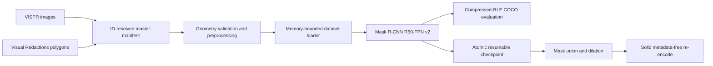

# ConsentGuard historical training setup report - invalidated

> **INVALIDATED 12 August 2026:** This report describes an engineering setup
> whose processed records paired Visual Redactions masks with unrelated VISPR
> pixels. The records and checkpoints were deleted after the forensic audit.
> Do not execute the training commands in this historical report. See
> `DATASET_DOWNLOAD_STATUS.md` and the full audit PDF for the current state.

**Snapshot:** 11 August 2026, 16:04 IST  
**Workspace:** `C:\consentGuard`  
**Milestone:** Visual privacy instance-localizer training setup

## Executive verdict

Historical result: the engineering setup appeared **ready to train**. The Python/CUDA environment,
processed-data loader, Mask R-CNN model, optimizer, mixed precision,
class-balanced sampling, COCO evaluation, checkpoint resume, and destructive
redaction export have all passed executable smoke tests on the local RTX 3050
Laptop GPU.

All three VISPR archives have now passed exact-size and full gzip/TAR
validation, then completed safe staged extraction. The final processed manifest
contains 3,873 train, 1,611 validation, and 2,988 untouched test records; one
unavailable image is explicitly quarantined rather than silently substituted.
The strict full-dataset split-leakage audit, CUDA preflight, and unit tests all
pass. A real 100-step GPU benchmark completed with a valid resumable checkpoint.

This report covers the trainable privacy-localization milestone. The broader
consent schema, OCR safety net, face safety net, policy engine, reviewer UI, and
post-export attack suite remain later milestones in
`ConsentGuard_Final_Research_Design.md`.

## What the system trains

The primary model is TorchVision **Mask R-CNN ResNet-50 FPN v2**, initialized
from official COCO weights and adapted to 28 Visual Redactions privacy classes
plus background (29 output classes).

It predicts a separate class, box, confidence, and pixel mask for each private
region. Instance segmentation is a direct match for overlapping regions and
for the final solid-pixel renderer. The localizer does not infer consent,
legality, intent, identity, or whether an image is morally acceptable to post.



### Why this architecture

- FPN and smaller anchors support faces, text, IDs, and other small regions.
- Instance masks preserve overlapping annotations and feed the renderer
  directly.
- TorchVision provides a mature, reproducible reference implementation and a
  documented head-replacement pattern.
- Mask R-CNN v2's official COCO initialization reports 41.8 mask AP and is a
  stronger starting point than the older v1 weights.
- The architecture fits the available 4 GB GPU under the tested laptop profile.

Official references:

- [TorchVision detection tutorial](https://docs.pytorch.org/tutorials/intermediate/torchvision_tutorial.html)
- [Mask R-CNN ResNet-50 FPN v2 documentation](https://docs.pytorch.org/vision/main/models/generated/torchvision.models.detection.maskrcnn_resnet50_fpn_v2.html)
- [PyTorch AMP documentation](https://docs.pytorch.org/docs/stable/amp.html)
- [PyTorch reproducibility notes](https://docs.pytorch.org/docs/stable/notes/randomness)
- [Official COCO API](https://github.com/cocodataset/cocoapi)

## Is this a copy of another project?

No single prior project is being copied, but the localizer itself is deliberately
a reproducible baseline, not a novelty claim. Automatic privacy detection,
Mask R-CNN, Visual Redactions, personalized privacy, and context-aware privacy
all have prior work.

The defensible project contribution is the larger operational research design:
explicit consent-state records, fail-closed region-level policy, uncertainty
handling, auditable decisions, and separate measurement of detector, policy,
renderer, and recoverability failures. Do not claim that this project invented
automatic redaction or consent-aware privacy detection. A publication-level
“first” claim requires a formal systematic review.

## Dataset decision

### Core data

- **Visual Redactions:** official 28-class region polygons/masks and official
  train/validation/test task partitions.
- **VISPR:** image source resolved by image ID across all VISPR folders. VISPR
  split names must not be substituted for Visual Redactions task splits.

### Non-core data

The downloaded VPD public repository is complete at 33,006,447,236 bytes and
contains public videos. The audited release did not expose the paper's claimed
100,000-image/190,000-box package. VPD is therefore outside the critical path;
its absence does not weaken the core experiment.

### Current processed-data profile

| Property | Current verified value |
|---|---:|
| Available processed records | 8,472 |
| Train / validation / test records | 3,873 / 1,611 / 2,988 |
| Pending unavailable images | 1 |
| Total instances | 48,824 |
| Train instances | 21,488 |
| Privacy classes | 28 |
| Mean train instances/image | 5.548 |
| Maximum train instances in one image | 121 |
| Rarest train class | `a29_ausweis`, 20 instances |
| Most common train class | `a109_person_body`, 5,936 instances |
| Maximum train class-count ratio | 296.8× |

All available records are ready for the protocol: use train for fitting,
validation only for selection/threshold decisions, and leave the 2,988-image
test partition untouched until the final frozen evaluation. The single
unavailable task image remains in `pending_records.jsonl` and is not imputed.

## Download integrity incident and recovery

Two old `curl` processes were discovered writing the same VISPR archive. Exact
byte length was therefore not accepted as proof of integrity. Sequential gzip
reads found corruption.

The contaminated files were preserved for audit, not deleted:

- `data/raw/vispr/val2017.tar.gz.corrupt-20260810-194318`
  (9,435,240,408 bytes)
- `data/raw/vispr/test2017.tar.gz.corrupt-20260810-195100`
  (11,353,362,305 bytes)

Recovery controls now implemented:

- one exclusive `.download.lock` per destination;
- duplicate writers exit with code 3;
- exact expected-size checks;
- complete gzip/tar stream validation;
- rejection of path traversal, links, duplicate members, and special files;
- free-space gate;
- extraction into a process-owned staging directory;
- extracted file/size manifest verification before atomic publication;
- atomic manifest/record generation.

Recovery completed successfully. The clean VISPR train, validation, and test
archives now have their exact expected byte sizes and passed complete gzip/TAR
stream validation. Safe staged extraction published all test media atomically;
the rebuilt master manifest has 8,473 task entries, 8,472 resolvable images,
and one explicit pending entry.

No raw archive or audit copy is automatically deleted.

## Preprocessing and loader

The released image dimensions often differ from annotation dimensions. The
preprocessor therefore:

1. decodes each image;
2. computes independent x/y scale factors;
3. scales and clamps every box and polygon;
4. rejects malformed, non-finite, out-of-bounds, or zero-area instances;
5. writes model-ready JSONL atomically without modifying raw data.

One zero-area polygon instance was excluded with an explicit reason. The
enhanced validator passed all 8,472 available records and 48,824 total
instances, with no invalid records, duplicate IDs, duplicate image paths, or
unknown classes. One image remains pending because no released local media
could be resolved for it.

The loader avoids a common RAM failure: it transforms polygon coordinates and
only rasterizes masks at the final model input size. It never creates one
full-source-resolution mask per instance. Evaluation is deterministic and
augmentation-free.

Training-only augmentation in the laptop profile:

- 75% instance-centred 512×512 crops;
- four-times-object context with at least 25% visibility for retained regions;
- fallback to the full image if a crop becomes empty;
- 15% mild brightness/contrast perturbation;
- no horizontal flip by default, because mirrored text/document content can be
  harmful and unrealistic.

## Training configurations

### Laptop profile: `configs/train_maskrcnn_4gb.yaml`

- input short/long side: 512/768;
- batch size: 1;
- gradient accumulation: 4 microbatches;
- AMP: enabled;
- one trainable backbone stage;
- anchors: 16, 32, 64, 128, 256 with three aspect ratios;
- class sampling: capped inverse-square-root image weights;
- optimizer: SGD, LR 0.001, momentum 0.9, weight decay 0.0005;
- 500-step linear warm-up and gradient norm clipping at 10;
- 25 epochs, StepLR at epoch 8 with gamma 0.1;
- 100 detections/image and reduced proposal counts;
- cuDNN benchmark disabled for stable memory and reproducibility behavior.

### Scientific baseline: `configs/train_maskrcnn_baseline.yaml`

- full-image 800/1333 resize;
- batch size 2;
- uniform sampling and standard anchors;
- three trainable backbone stages;
- intended for a controlled 12–16 GB GPU.

Hardware accommodations and scientific choices are separate configurations so
the laptop profile cannot silently become the claimed baseline. The final study
must report uniform-versus-balanced and standard-versus-small-anchor ablations.

### Optional Mask2Former comparison

`configs/train_mask2former.yaml` documents a later Swin-Tiny Mask2Former
comparison. It is not installed as the local default and is not claimed ready
on the 4 GB GPU. It should only be implemented/run after the Mask R-CNN baseline
on a roughly 16 GB GPU. SAM/SAM2 may refine prompted regions later, but it is
not a class-aware automatic privacy detector by itself.

- [Mask2Former documentation](https://huggingface.co/docs/transformers/model_doc/mask2former)

## Evaluation design

Validation computes official COCO bbox and segmentation AP/AR:

- AP@[0.50:0.95], AP50, AP75;
- small, medium, and large AP/AR;
- per-class segmentation AP and AR100;
- segmentation mAP is the checkpoint-selection metric.

Dense prediction and target masks are converted immediately after each batch to
compressed COCO RLE. Bbox and segmentation detections are evaluated separately
so segmentation area buckets are not accidentally computed from box area. This
prevents a full validation run from retaining hundreds of gigabytes of dense
masks in host RAM.

Validation uses score threshold 0.0 and the standard maximum of 100 detections
per image. Deployment thresholds must be selected on validation only. The test
split remains locked until the protocol and thresholds are frozen.

## Checkpoint and resume guarantees

Each checkpoint contains:

- model, optimizer, scheduler, and AMP scaler state;
- epoch and global optimizer step;
- best segmentation mAP and last evaluation;
- resolved configuration and class map;
- CPU/CUDA RNG plus loader/sampler generator state;
- environment snapshot.

Writes use a temporary file followed by atomic replacement. Immutable epoch and
best aliases use NTFS hard links when supported, avoiding two or three physical
copies of the same 300–370 MB checkpoint. Resume rejects changed model,
optimizer, scheduler, or class-map configurations. Evaluation/inference also
reject a configuration that could silently change model geometry or input size.
All local checkpoint loads use `weights_only=True`.

## Redaction/export behavior

Accepted instance masks are unioned, optionally filtered by class, dilated, and
replaced with solid pixels. The result is freshly encoded as JPEG/PNG/WebP;
source metadata is never copied. The writer refuses to overwrite the source,
atomically publishes the output, reopens it independently, checks dimensions,
and writes a geometry/hash audit sidecar.

This is safer than blur or pixelation, but a scientific “safe release” claim
still requires the later OCR, face, metadata, thumbnail, and recovery-attack
assurance suite.

## Executed verification evidence

| Gate | Result |
|---|---|
| Python compile of `src`, `scripts`, and `tests` | Passed |
| Processed records | 8,472 records / 48,824 instances; passed |
| Loader smoke | 100 images / 483 instances; passed |
| Tiny gradient-path smoke | loss 0.698478 → 0.630880; passed |
| Strict split-leakage audit | 8,472 images; complete partition coverage; 0 exact and 0 pHash-distance≤5 cross-split candidates; passed |
| Environment | Python 3.11.9, Torch 2.13.0+cu126, TorchVision 0.28.0+cu126, CUDA 12.6; passed |
| CUDA operators | CUDA NMS and ROI Align passed |
| COCO backend | pycocotools compressed-RLE round trip passed |
| Unit tests | 9/9 passed in 13.41 seconds |
| Tiny real Mask R-CNN train/eval | CUDA forward, backward, optimizer, bbox+mask evaluation, checkpoint passed |
| Tiny checkpoint resume | resumed global step 1 → 2; passed |
| Standalone evaluation CLI | passed |
| Inference/export CLI | 20 engineering-only random detections; output reopened and hashes differ; passed |
| Exact laptop profile | pretrained 512 px AMP + four-microbatch optimizer step passed |
| Laptop smoke memory | 857,735,168 bytes peak reserved, 19.97% of GPU total for sampled step |
| Full-data 100-step GPU benchmark | 100 optimizer steps in 71.45 seconds; loss 9.5967 → 1.1798; 1,241,513,984 bytes peak reserved (28.91% of GPU); checkpoint load passed |
| Checkpoint publication | hard-link relationship verified with `fsutil`; passed |

The tiny random model's bbox/segmentation mAP was 0.0, which is expected after
one or two optimizer steps and is not a model-quality result. Its generated
redaction is evidence of plumbing only.

The 100-step benchmark is a data-loader, optimization, checkpoint, and memory
readiness result—not a quality claim. It intentionally skipped full validation;
the first quality checkpoint must be selected from the official validation
split after a complete training epoch.

Primary evidence files:

- `reports/training_environment_preflight.json`
- `reports/pytest-results.xml`
- `reports/processed_records_validation.json`
- `reports/training_data_profile.json`
- `reports/split_leakage_audit.json`
- `reports/maskrcnn_smoke_evaluation.json`
- `artifacts/checkpoints/smoke/training_result.json`
- `artifacts/checkpoints/4gb-profile-smoke/training_result.json`
- `artifacts/checkpoints/benchmark_100steps/training_result.json`
- `artifacts/checkpoints/benchmark_100steps/metrics.jsonl`
- `outputs/redacted/maskrcnn_smoke.png.json`

## Environment reproducibility

Use the resumable setup:

```powershell
Set-Location C:\consentGuard
powershell.exe -NoProfile -ExecutionPolicy Bypass -File scripts\setup_environment.ps1
```

The setup verifies and caches:

- Torch wheel: 2,594,548,547 bytes, SHA-256
  `8095729db14e7fd5178a39676fdd679208eff4041407ea34e3d898336c90f5c5`;
- TorchVision wheel: 8,520,320 bytes, SHA-256
  `8a976240db376f83dda566bc71320071cbf5f0a013c87b3f34e0e81f2ca96da8`;
- Mask R-CNN v2 COCO weights: 185,828,065 bytes, SHA-256
  `73cbd0190fcbe3ba339921fbce2c3a0b6bb9126c9a133c85e43a2a8e060a109e`.

Exact verified dependencies are frozen in
`requirements/environment-lock.txt`.

## Stop gates before a scientific run

Do not begin the full run if any condition below is true:

1. the validation archive or extracted directory is incomplete or fails a full
   sequential integrity check;
2. `records_val2017.jsonl` is missing/empty;
3. processed-record validation fails;
4. full split-leakage certification is incomplete or duplicate candidates are
   unresolved;
5. CUDA/TorchVision/COCO preflight fails;
6. test data has been used for hyperparameter or threshold selection;
7. disk space is insufficient for checkpoints and atomic temporary files.

## Commands for the verified full run

Check download/finalization state:

```powershell
powershell.exe -NoProfile -ExecutionPolicy Bypass -File scripts\check_dataset_status.ps1
Get-Content data\downloads\complete_remaining_vispr.stdout.log -Tail 30
Get-Content data\downloads\complete_remaining_vispr.stderr.log -Tail 30
```

Re-run the final gates:

```powershell
.\.venv\Scripts\python.exe scripts\validate_processed_records.py
.\.venv\Scripts\python.exe scripts\audit_split_leakage.py --workers 4 --fail-on-near-duplicates
.\.venv\Scripts\python.exe scripts\preflight_environment.py
.\.venv\Scripts\python.exe -m pytest -q
```

Start the laptop run only when every gate above passes:

```powershell
.\.venv\Scripts\python.exe scripts\train_maskrcnn.py `
  --config configs\train_maskrcnn_4gb.yaml
```

Resume safely:

```powershell
.\.venv\Scripts\python.exe scripts\train_maskrcnn.py `
  --config configs\train_maskrcnn_4gb.yaml `
  --resume artifacts\checkpoints\maskrcnn_4gb\last.pt
```

Monitor:

```powershell
.\.venv\Scripts\tensorboard.exe --logdir artifacts\checkpoints\maskrcnn_4gb\tensorboard
```

Evaluate the selected validation checkpoint:

```powershell
.\.venv\Scripts\python.exe scripts\evaluate_maskrcnn.py `
  --config configs\train_maskrcnn_4gb.yaml `
  --checkpoint artifacts\checkpoints\maskrcnn_4gb\best.pt
```

The real full-data laptop benchmark completed 100 optimizer steps in 71.45
seconds using four microbatches per step. Treat this as a hardware-throughput
check only: final elapsed time will also depend on epoch-end validation,
checkpoint writes, and the selected stopping protocol.

## Final status

- **Code/environment:** ready.
- **RTX 3050 laptop profile:** executable, full-data benchmarked, and
  checkpoint-verified.
- **Data protocol:** train/validation/test partitions complete and leakage
  certified; one unavailable image is explicitly excluded.
- **Full scientific train/validation run:** cleared to start.
- **VPD-100K dependency:** removed from the core path.
- **Broader consent-aware safe-release system:** designed, not yet fully
  implemented in this training milestone.
