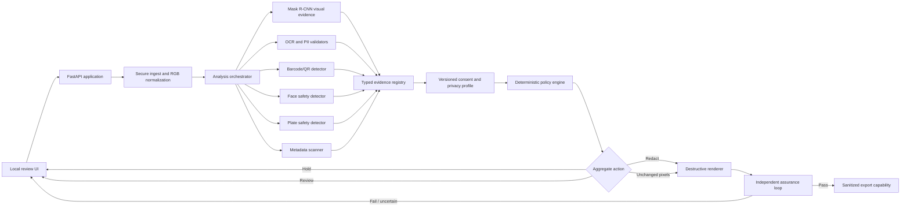

# ConsentGuard End-to-End Implementation Plan

**Working product title:** From Detection to Safe Release  
**Plan version:** 1.0  
**Date:** 19 August 2026  
**Target:** Research-grade, local-first, still-image pre-share assistant  
**Primary outcome:** Reproducible thesis/paper prototype and staged-data demo  

## 1. Executive decision

The project will stop treating detector mAP as the final product. The existing
Mask R-CNN checkpoint becomes one evidence provider inside a larger release
control system.

The system is complete only when it can:

1. securely ingest and normalize a still image;
2. detect visual, textual, barcode, face, plate, and metadata evidence;
3. preserve the source and uncertainty of every evidence item;
4. process explicit, scoped consent records without inferring consent from pixels;
5. deterministically choose `ALLOW_PIXELS_UNCHANGED`, `ALLOW_REDACTED`,
   `HOLD_FOR_CONSENT`, or `MANUAL_REVIEW`;
6. allow a reviewer to correct masks and subject bindings;
7. render a destructive, flattened, newly encoded output;
8. independently attack the output for residual OCR, barcode, face, mask, and
   metadata leakage;
9. make a file downloadable only after all required checks pass; and
10. report unsafe-release rate, over-protection, review burden, utility, and
    failure modes on frozen evaluation data.

The project will not claim automatic consent inference, legal compliance,
identity recognition, or guaranteed privacy.

## 2. Current baseline and why development must pivot

Completed and reusable:

- same-release Visual Redactions data pipeline and provenance checks;
- cross-split duplicate audit and quarantine;
- Mask R-CNN training, resume, evaluation, and diagnostics;
- best validation checkpoint: moderate balancing, segmentation mAP 0.2335;
- metadata-free solid-redaction proof of concept;
- reproducible configuration, checkpoint, and metrics infrastructure;
- 17 passing unit/integration tests as of this plan.

Known blockers to automatic release:

- validation sensitive-pixel leakage at score 0.5 is approximately 23.6%;
- handwriting, plates, medicine, and signatures have severe uncovered-pixel rates;
- object-centric crops and class-agnostic masks did not beat the moderate baseline;
- no OCR/PII, barcode, face-safety, specialist plate, or metadata evidence modules;
- no evidence registry, consent lifecycle, policy engine, review UI, assurance
  loop, or end-to-end release gate;
- no locked end-to-end privacy/utility evaluation.

Decision: freeze the moderate-balanced model as the primary visual baseline.
Additional detector training is allowed only when an error analysis names a
specific failure and a preregistered experiment can test it. No open-ended mAP
tuning is on the critical path.

## 3. Non-negotiable system invariants

1. No unchecked export: a file cannot reach the download path before assurance
   returns `PASS` for every mandatory check.
2. Unknown is not granted: missing, malformed, expired, revoked, conflicting,
   or scope-mismatched consent cannot silently become permission.
3. Models produce evidence, not consent or legal decisions.
4. Critical secrets are destructively redacted regardless of ordinary profile
   preferences.
5. Raw OCR strings, real names, consent forms, source paths, and biometric
   templates are not written to ordinary logs.
6. The output is constructed from a normalized RGB buffer, flattened against an
   opaque background, and newly encoded with an explicit metadata allowlist.
7. Blur and pixelation are experimental comparators. Solid replacement and crop
   are the safe defaults.
8. Test data stays locked until architecture, thresholds, policy, and analysis
   scripts are frozen.
9. Every decision contains machine-readable reason codes and component versions.
10. Any unhandled enum value, provider failure, timeout, or assurance ambiguity
    fails closed to hold or manual review.

## 4. Target architecture



The UI and API are adapters. All safety logic lives in framework-independent
Python services so it can be exhaustively tested without a browser.

## 5. Chosen technical stack

### Core application

- Python 3.11, matching the existing training environment.
- Pydantic models plus JSON Schema 2020-12 for strict external contracts.
- FastAPI for typed local API endpoints and end-to-end API tests.
- Gradio mounted on FastAPI for the research UI. `ImageEditor` supports brush,
  eraser, crop, and layers, which is sufficient for a mask-correction MVP.
- SQLite for consent/policy/audit metadata only. Source images and OCR strings
  remain session-local and expire; SQLite must not become a raw-PII store.
- UUID session identifiers and SHA-256 hashes; never use user filenames as keys.

### Evidence providers

- Existing moderate-balanced Mask R-CNN for the nine visual classes.
- OCR provider interface with a measured bake-off:
  - candidate A: local PaddleOCR PP-OCRv6 for quadrilateral detection and
    multilingual/handwriting capability;
  - candidate B: Tesseract 5 baseline for compatibility and an independent
    post-export attacker;
  - PaddleOCR high-performance inference is not assumed on native Windows;
    its official documentation recommends WSL/Docker for that configuration.
- Microsoft Presidio Analyzer for PII classification and typed validators,
  including checksum/context recognizers and India-specific identifiers. Feed it
  OCR text in memory and map spans back to OCR polygons. Never treat its output
  as complete; its own documentation warns that automated detection can miss PII.
- zxing-cpp Python bindings for QR, Data Matrix, PDF417, Aztec, EAN/UPC, Code 128,
  and other supported barcode families.
- OpenCV YuNet as a face-localization-only safety net. Do not load a face
  recognition model or create embeddings.
- Specialist plate detector behind the same provider interface. OpenCV Zoo's
  LPD-YuNet is the first candidate, but its exact weight license and performance
  on our staged/validation data must pass a gate before adoption.
- Pillow/OpenCV for normalization and raster operations; ExifTool as an
  independent metadata inspection tool in tests and assurance.

### Deployment boundary

- Localhost-only by default.
- No cloud OCR, VLM, analytics, telemetry, or public upload service in the MVP.
- GPU concurrency is one request at a time; CPU evidence providers may run in a
  bounded worker pool.
- If PaddleOCR conflicts with the PyTorch CUDA environment, run it as a pinned
  local subprocess/service with a separate dependency lock. Do not destabilize
  the verified detector environment.

## 6. Core contracts

### 6.1 Normalized asset

Required fields:

- `asset_id`, `session_id`;
- source SHA-256 and normalized-pixel SHA-256;
- detected format, decoded width/height, frame count, byte count;
- orientation applied;
- metadata categories present, recorded without sensitive values;
- normalized RGB buffer reference;
- ingest status and reason codes.

### 6.2 Evidence item

Required fields:

- `evidence_id` and `asset_id`;
- provider and provider version;
- privacy class and ontology group;
- polygon/mask at original-image coordinates;
- confidence and confidence semantics;
- uncertainty flags;
- sensitivity tier;
- optional abstract `subject_ref`;
- provenance links to unmerged provider detections;
- creation timestamp and evidence-schema version.

OCR text values remain ephemeral. Persistent reports contain salted/keyed token
digests, lengths, validator types, and geometry—not plaintext.

### 6.3 Consent record

Required fields:

- random `record_id` and local pseudonymous `subject_ref`;
- bound person-region references;
- exact media-version digest;
- exact share-context digest;
- operation, audience, purpose;
- state: `UNKNOWN`, `PENDING`, `GRANTED`, `DENIED`, `REVOKED`, or `EXPIRED`;
- issue, expiry, and revocation timestamps;
- assertion source and assurance level;
- policy version and optional non-authoritative notes.

### 6.4 Policy decision

Required fields:

- per-evidence action and reason codes;
- aggregate release action;
- required redaction masks;
- unresolved bindings/conflicts;
- policy and schema versions;
- evidence/provider versions;
- assurance requirements;
- deterministic decision digest.

## 7. Delivery phases and hard gates

Effort estimates are focused engineering days, not calendar promises. Total
expected effort is roughly 35-55 focused days, normally 8-12 full-time weeks or
12-18 part-time weeks. A polished human study or publication submission adds
time and may require ethics approval.

### Phase 0 — Close and freeze perception research (1-2 days)

Deliverables:

- record best epoch and diagnostics for moderate, crop, and class-agnostic runs;
- mark crop and class-agnostic experiments as negative results;
- hash the selected checkpoint, config, class map, and validation manifest;
- ensure the test split remains unopened;
- preserve all current user changes and obtain a clean, intentional commit scope;
- run the complete existing test suite and environment preflight.

Gate 0:

- one immutable primary checkpoint and config are named;
- test split is still locked;
- the current suite passes;
- no more detector experiment starts without a written hypothesis.

### Phase 1 — Typed domain core and deterministic policy (4-6 days)

Suggested modules:

```text
src/consentguard/domain/enums.py
src/consentguard/domain/evidence.py
src/consentguard/domain/consent.py
src/consentguard/domain/decisions.py
src/consentguard/policy/engine.py
src/consentguard/policy/policy_v1.yaml
schemas/evidence-v1.schema.json
schemas/consent-v1.schema.json
schemas/decision-v1.schema.json
tests/policy/
```

Implement:

- strict models and schema export;
- allowed consent-state transitions;
- scope matching across media version, audience, purpose, and operation;
- revocation/denial precedence and conflict resolution;
- critical-secret safety floor;
- fail-closed aggregate action precedence;
- stable reason-code catalogue;
- deterministic decision serialization and hashing.

Testing:

- table-driven coverage of every consent state and transition;
- property tests for invariants such as “adding a denial cannot make release more
  permissive” and “malformed input cannot produce automatic release”;
- multi-subject, overlap, expired, revoked, scope-change, and conflict fixtures;
- unknown enum/schema versions fail closed.

Gate 1:

- 100% expected-action conformance on the frozen policy table;
- 100% branch coverage for aggregate action logic;
- no model is called by policy code.

### Phase 2 — Secure ingest, session isolation, and evidence registry (4-6 days)

Suggested modules:

```text
src/consentguard/ingest/decoder.py
src/consentguard/ingest/limits.py
src/consentguard/ingest/metadata.py
src/consentguard/evidence/registry.py
src/consentguard/sessions/store.py
tests/ingest/
tests/evidence/
```

Implement:

- allowlist JPEG/PNG/WebP only for MVP;
- signature, extension, decoder result, and content-type cross-checks;
- maximum bytes, pixels, dimensions, aspect ratio, and one-frame limit;
- Pillow decompression-bomb errors treated as hard failures;
- EXIF orientation application before hashing normalized pixels;
- fresh RGB buffer construction and alpha flattening;
- random session directories outside any served static path;
- TTL cleanup and atomic writes;
- evidence deduplication that retains all provider provenance.

Security fixtures:

- spoofed extensions/MIME types;
- truncated and corrupt files;
- oversized dimensions and decompression bombs;
- animated files;
- EXIF rotation cases;
- PNG text chunks, JPEG EXIF/XMP/IPTC, embedded thumbnails, alpha data;
- malicious filenames and attempted path traversal.

Gate 2:

- no rejected input reaches a model provider;
- no source filename controls a path;
- normalized dimensions and geometry are verified;
- security fixtures pass on Windows.

### Phase 3 — Multimodal evidence providers (7-11 days)

Suggested modules:

```text
src/consentguard/evidence/providers/base.py
src/consentguard/evidence/providers/maskrcnn.py
src/consentguard/evidence/providers/ocr.py
src/consentguard/evidence/providers/pii.py
src/consentguard/evidence/providers/barcode.py
src/consentguard/evidence/providers/face_yunet.py
src/consentguard/evidence/providers/plate.py
src/consentguard/evidence/orchestrator.py
tests/providers/
```

Implement:

- one provider protocol returning original-coordinate evidence;
- explicit provider timeouts, failures, and version metadata;
- Mask R-CNN adapter using the frozen checkpoint;
- OCR word/line polygons and text held only in the active process/session;
- Presidio/custom validation for email, phone, payment card, IBAN, IP, URL,
  PAN, Aadhaar, GSTIN, passport, voter ID, vehicle registration, dates, names,
  and addresses, with country/profile configuration;
- QR/barcode position, type, validity, and salted content digest;
- YuNet face boxes expanded with a validation-selected safety margin;
- plate detector candidate and fallback to review when specialist evidence is
  unavailable;
- deterministic fusion by IoU/containment without discarding contradictions.

Synthetic evidence corpus:

- fake cards, IDs, letters, prescriptions, tickets, receipts, screenshots, and
  forms;
- only fictional values, with both valid and invalid checksums;
- font, script, size, rotation, perspective, blur, glare, compression, border,
  occlusion, and screen-photograph variants;
- QR/barcode families and error-correction levels;
- a final attack split held out from all threshold selection.

Gate 3:

- provider contract tests pass;
- every output geometry maps correctly to original pixels;
- no plaintext fake token appears in logs/reports;
- OCR and specialist choices are based on measured recall/latency, not popularity;
- weak or failed providers trigger uncertainty/review rather than disappearing.

### Phase 4 — Calibration, uncertainty, and review operating points (4-6 days)

Implement:

- per-provider and per-class threshold sweeps on validation only;
- privacy-weighted false-negative cost;
- reliability diagrams/ECE where scores have probabilistic meaning;
- risk-coverage curves for review budgets such as 5%, 10%, 20%, and 30%;
- uncertainty flags for low confidence, cross-provider conflict, tiny regions,
  unreadable text, boundary clipping, and out-of-distribution conditions;
- validation-selected mask dilation by evidence type and image resolution;
- one frozen operating point for the final test.

Do not assume temperature scaling alone solves segmentation uncertainty. Use it
as a baseline and select review behavior from empirical risk-coverage results.

Gate 4:

- thresholds and review rules are frozen before test evaluation;
- the chosen operating point has a documented review burden and upper confidence
  bound for unsafe automatic release on validation;
- per-class weak points remain visible.

### Phase 5 — Destructive renderer and independent assurance loop (5-8 days)

Suggested modules:

```text
src/consentguard/redaction/renderer.py
src/consentguard/redaction/mask_ops.py
src/consentguard/assurance/ocr_attack.py
src/consentguard/assurance/barcode_attack.py
src/consentguard/assurance/metadata_attack.py
src/consentguard/assurance/visual_attack.py
src/consentguard/assurance/verifier.py
tests/redaction/
tests/assurance/
```

Implement:

- union masks at original resolution;
- type-specific dilation covering text edges and barcode quiet zones;
- solid replacement and crop as core methods;
- blur/pixelation only as evaluated baselines;
- opaque layer flattening and explicit output format/quality;
- output to a temporary path followed by reopen and decode verification;
- a bounded assurance loop that expands/rerenders on failure;
- independent OCR engine, zxing-cpp, ExifTool, second decoder, residual-mask,
  and optional staged face checks;
- atomic promotion from candidate output to exportable output only after pass;
- geometry/hashes/reason codes in sidecars, never sensitive strings.

Gate 5:

- oracle-mask solid redaction yields zero exact/fuzzy fake-token recovery and zero
  barcode decode on the held-out attack suite;
- ExifTool finds no disallowed metadata or thumbnail;
- alternate decoder and alpha/layer checks pass;
- forced assurance failure can never create an export capability.

### Phase 6 — API and reviewer interface (5-8 days)

API endpoints:

```text
POST   /v1/sessions
POST   /v1/sessions/{id}/assets
POST   /v1/sessions/{id}/analyze
GET    /v1/sessions/{id}/evidence
PUT    /v1/sessions/{id}/evidence/{evidence_id}
POST   /v1/sessions/{id}/consent-records
POST   /v1/sessions/{id}/decide
POST   /v1/sessions/{id}/render
POST   /v1/sessions/{id}/verify
GET    /v1/sessions/{id}/export
DELETE /v1/sessions/{id}
GET    /health
```

UI workflow:

1. upload and ingest result;
2. evidence overlay with provider, class, confidence, and uncertainty separated;
3. editable masks and category corrections;
4. manual abstract subject-region bindings;
5. structured purpose/audience/operation and consent records;
6. per-region reasons and aggregate action;
7. redaction preview at full resolution;
8. assurance results and limitations;
9. download button visible only when an export capability exists.

Never show a green “safe” badge. Use precise language such as “required checks
passed for this prototype configuration; residual limitations remain.”

Gate 6:

- a staged image completes the full flow through the public API and UI;
- direct URL/API attempts cannot fetch source or unverified candidate files;
- refresh/retry/idempotency tests do not duplicate or bypass state transitions;
- deletion removes session media and invalidates export capabilities.

### Phase 7 — Benchmarks and locked evaluation (6-10 days)

Evaluation layers:

1. perception with ground-truth masks/tokens;
2. policy with oracle evidence and controlled consent interventions;
3. renderer with oracle masks and hidden fake values;
4. complete raw-image-to-export behavior.

Consent-intervention benchmark:

- pilot: 100 base images and at least 600 paired cases;
- final target: 500 base images and at least 3,000 cases if time allows;
- change one variable while pixels remain fixed: grant, private-only grant,
  denial, unknown, expired, revoked, redistribution mismatch, purpose change,
  multiple-subject conflict, or uncertain binding;
- expected actions come from the frozen policy, independently reviewed for
  implementation errors; they are not moral or legal ground truth.

Mandatory metrics:

- unsafe automatic release rate with 95% image-cluster bootstrap interval;
- over-protection rate;
- review burden and risk-coverage curve;
- aggregate-action macro F1 and reason-code accuracy;
- per-class sensitive-pixel recall and instance coverage;
- OCR polygon/token recall and barcode decode rate;
- metadata recovery and false-confidence count;
- non-sensitive-pixel retention and task-specific utility;
- latency, peak memory/VRAM, and provider failure rate.

Baselines:

- no protection;
- redact all;
- face + OCR only;
- visual localizer with one threshold and no consent;
- deterministic policy without abstention;
- deterministic policy with uncertainty/review;
- full system with post-export assurance;
- optional learned action predictor for comparison only, never release control.

Primary success criterion:

At a preregistered review-burden level, uncertainty-aware review must reduce
unsafe automatic releases relative to the same pipeline without review while
preserving more utility than redact-all. A negative result is acceptable and
must be reported honestly.

Gate 7:

- architecture, thresholds, policy, and analysis script are frozen;
- test manifest is evaluated once;
- confidence intervals and negative results are included;
- raw/staged/private examples are handled according to their licenses/consent.

### Phase 8 — Reproducibility and project release (3-5 days)

Deliverables:

- one-command CPU demo setup and documented optional GPU path;
- pinned dependency groups and model downloads with hashes;
- model, data, system, privacy, and limitations cards;
- updated `THIRD_PARTY.md` with every model/code/data license;
- architecture, threat model, API, policy, and evaluation documentation;
- staged/fake demo examples only;
- final report/thesis figures generated from machine-readable results;
- clean-environment reproduction of one end-to-end evaluation by a second run.

Gate 8 / definition of done:

- no unchecked file can be exported;
- policy conformance and oracle renderer attack gates pass;
- the final evaluation is reproducible;
- limitations are visible in both UI and report;
- no claim says consent was inferred, privacy is guaranteed, or the system is
  legally compliant.

## 8. Testing strategy

Test pyramid:

- unit: schemas, transitions, scope matching, reason codes, geometry, dilation,
  token-to-polygon mapping, provider adapters;
- property/fuzz: malformed consent, unknown enums, random geometry, upload
  filenames, decoder failures, monotonic policy invariants;
- contract: all evidence providers return the same versioned format;
- integration: ingest to evidence, policy to renderer, renderer to assurance;
- security: upload bypasses, decompression bombs, metadata/thumbnail/alpha
  leakage, direct file access, path traversal, stale export tokens;
- golden: staged images with approved overlays and expected actions;
- end to end: API and browser workflow using fake/staged media;
- scientific regression: fixed validation subset and metric-tolerance checks.

Every bug that could cause unsafe release receives a permanent regression test.

## 9. Immediate next work package

The next implementation package is Phase 0 plus the first half of Phase 1:

1. produce final summaries for the completed crop and class-agnostic runs;
2. freeze and hash the moderate-balanced checkpoint and validation manifest;
3. create the domain enums and Pydantic schemas;
4. encode consent state transitions and scope matching;
5. implement the first deterministic policy table;
6. add exhaustive table-driven tests;
7. stop at Gate 1 and review the reason codes before adding OCR or UI code.

This order proves the central research contribution early. It also gives every
later detector a stable interface and prevents the UI from inventing policy.

## 10. Research basis and component cautions

- Visual Redactions established the privacy-utility value of segmentation-based
  redaction, so this project must contribute safe decision/release behavior rather
  than claim redaction-by-segmentation as new:
  https://openaccess.thecvf.com/content_cvpr_2018/html/Orekondy_Connecting_Pixels_to_CVPR_2018_paper.html
- BIV-Priv-Seg shows modern models struggle with small, non-salient private
  objects and with recognizing negative images, supporting specialist branches
  and explicit abstention:
  https://openaccess.thecvf.com/content/WACV2025/papers/Tseng_BIV-Priv-Seg_Locating_Private_Content_in_Images_Taken_by_People_with_WACV_2025_paper.pdf
- Selective prediction should be measured with risk-coverage behavior, not only
  confidence thresholds:
  https://proceedings.mlr.press/v97/geifman19a.html
- Temperature scaling is a useful calibration baseline, not a safety guarantee:
  https://arxiv.org/abs/1706.04599
- NIST AI RMF supports lifecycle-wide test, evaluation, verification, and
  validation, which maps to the project’s gated evidence approach:
  https://www.nist.gov/publications/artificial-intelligence-risk-management-framework-ai-rmf-10
- OWASP recommends allowlisted formats, signature/content validation, generated
  filenames, resource limits, isolated storage, and image rewriting:
  https://cheatsheetseries.owasp.org/cheatsheets/File_Upload_Cheat_Sheet.html
- Pillow documents decompression-bomb defenses and the need to explicitly avoid
  carrying EXIF/XMP/PNG metadata into rewritten outputs:
  https://pillow.readthedocs.io/en/stable/reference/Image.html
- DPV provides useful vocabulary for purpose, processing, data subjects, and
  consent lifecycle, but it is a W3C Community Group specification rather than a
  W3C standard and must not be treated as proof of compliance:
  https://www.w3.org/community/reports/dpvcg/CG-FINAL-dpv-20240801/
- PaddleOCR offers current local OCR pipelines, but high-performance Windows
  deployment has environment constraints:
  https://www.paddleocr.ai/latest/en/version3.x/pipeline_usage/OCR.html
  https://paddlepaddle.github.io/PaddleOCR/main/en/version3.x/deployment/high_performance_inference.html
- Presidio provides extensible pattern, checksum, context, and NER recognizers,
  including India-specific identifiers, while explicitly warning that automated
  detection is incomplete:
  https://microsoft.github.io/presidio/supported_entities/
- zxing-cpp exposes maintained Python bindings for many barcode families:
  https://github.com/zxing-cpp/zxing-cpp/blob/master/wrappers/python/README.md
- YuNet provides a lightweight face-localization model with an MIT-licensed model
  directory; only detection, not recognition, is in scope:
  https://github.com/opencv/opencv_zoo/blob/main/models/face_detection_yunet/README.md
- Gradio can be mounted on FastAPI and its ImageEditor supports editable brushes,
  erasing, cropping, and layers:
  https://www.gradio.app/docs/gradio/mount_gradio_app
  https://www.gradio.app/docs/gradio/imageeditor
- Recent systems such as CAIAMAR use agentic reasoning and diffusion-based
  anonymization. They are relevant comparisons, but their complexity and
  nondeterminism are intentionally outside this project’s release controller:
  https://arxiv.org/abs/2603.27817

